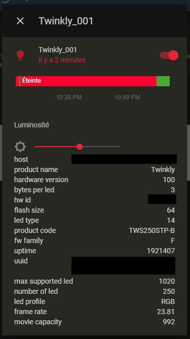

# Twinkly for Home-Assistant


# >>> IMPORTANT NOTICE <<<

This integration [has been merged in Home-Assistant](https://github.com/home-assistant/core/pull/42103) core repository 
and will be available direclty from the HA UI starting from v0.119.
This repo will either be archived at this date, either be used as backlog for the twinkly integration in HA,
**BUT the custom integration hosted by this repo won't be updated anymore** (and might be removed at some point).

-------------------------

# >>> UPDATE FROM HACS / custom_components <<<

1. Remove all the twinkly lights you have defined in your `configuration.yaml` file
1. Restart Home-Assistant
1. In Home-Assistant go to **settings > integrations > + add > "twinkly"**
1. Set the "host" of the entity you just removed from the `configuration.yaml` file
1. Repeat 3. and 4. for all the devices you have
1. Enjoy 🎄

-------------------------


This project lets you control your [twinkly christmas lights](https://twinkly.com/) 
from [Home-Assistant](https://www.home-assistant.io/)

Using this component you are able to:
- Turn lights on and off 
- Configure the brigthness



## Setup
### Installation

The recommended way to install this integration is using the [Home Assistant Community Store (HACS)](https://hacs.xyz/). Search for "Twinkly" from the integrations tab.

If you prefer, you can also install it manually:
1. From the root directory of your HA, create a directory `custom_components/twinkly`.
1. Download all files from the [`custom_components/twinkly` directory](./custom_components/twinkly) of this repo and copy them in the folder you just created.


### Configuration
1. In your `configuration.yaml`, in the `light` section add your twinkly device:
```yaml
light:
  - platform: twinkly
    host: 192.168.123.123
    name: Christmas tree 
```
2. Restart Home-Assistant

- **Host:** _[Required]_ We currently do not support floating IP address, so make sure to assign a static IP to your twinkly device.
  You can assign it from your router's config.
- **Name:** _[Optional]_ Defines the name of this device. Even if it's optional, **we higly recommend you to configure it**. 
  If not set, the name will be retreived from the device, which means that if the device is not available (in july for instance ;)), 
  it will fallback to the default name which is 'Twinkly light' (and the device ID will be updated accordingly by HA).

## FAQ
### Is it possible to change the effect from HA?
Unfortunately, when you change the effect from the Twinkly app, it actually re-write the full light effect to the device.
So it means that to change the effect from HA, we would have to copy those effects and push them from HA each time. 
If it's possible for the "default effects" this would however override the mapping made from the app.
And for the "custom effect" (or defaults with mapping) it would require a way to extract the effect from the twinkly app,
which does not seems to be supported.

## Roadmap
- [x] Configure HACS
- [x] Add this repo to the default repos list of HACS
- [x] Add support of online / offline (and make sure that we don't have to restart HA when we plug a device)
- [x] Add ability to setup this integration from the UI
- [x] Merge as a component in the HA repo
- [ ] Replace custom client per https://github.com/scrool/xled 
- [ ] Add discovery of devices on LAN
- [ ] Add support of floating IP adress

## Thanks and ref
https://labs.f-secure.com/blog/twinkly-twinkly-little-star

https://github.com/joshkay/home-assistant-twinkly

https://xled-docs.readthedocs.io/en/latest/rest_api.html
