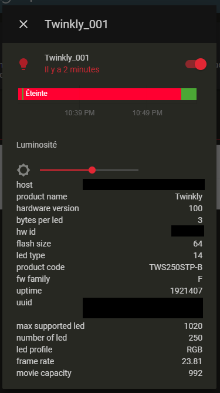

# Twinkly for Home-Assistant

Add support of [twinkly christmas lights](https://twinkly.com/) 

Using this component you are able to:
- Turn lights on and off 
- Configure the brigthness



## Configuration
1. In you `configuration.yaml`, in the `light` section add your twinkly device:
```yaml
light:
  - platform: twinkly
    host: 192.168.123.123 # cf. remaks below
```

> **Remaks**
> 
> We currently do not support floating IP address, so make sure to assign a static IP to your twkinly device.
> You can configure it in your router.

## FAQ
### Is it possible to change the effect from HA?
Unfortunately, when you change the effect from the Twinkly app, it actually re-write the full light effect to the device.
So it means that to change the effect from HA, we would have to copy those effects and push them from HA each time. 
If it's possible for the "default effects" this would however override the mapping made from the app.
And for the "custom effect" (or defaults with mapping) it would require a way to extract the effect from the twinkly app,
which does not seam to be supported.
